# List of tuple

<table>
<tr>
<td>

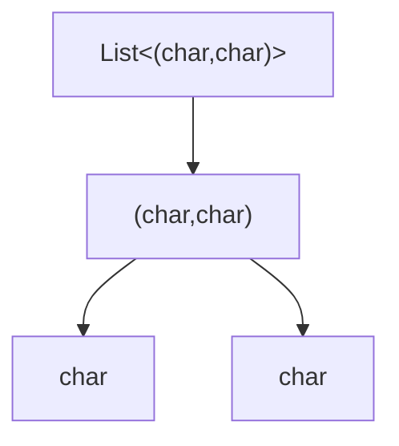
</td>
<td>

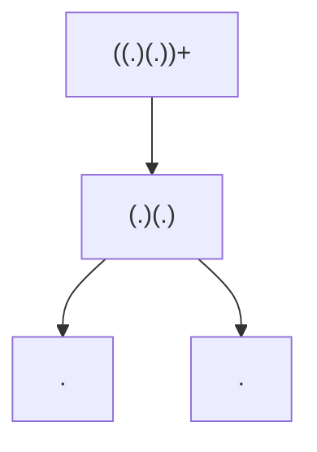
</td>
</tr>
</table>

# List of primitive type

<table>
<tr>
<td>

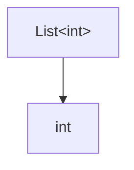
</td>
<td>

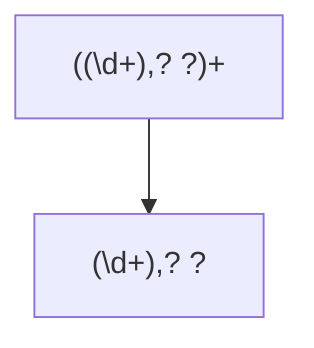
</td>
<td></td>
<td>

</td>
<td>

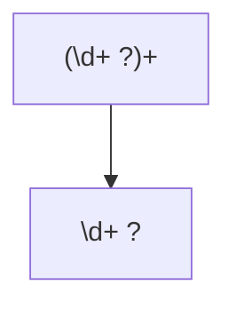
</td>
</tr>
</table>

# Dictionary of tuple including list

<table>
<tr>
<td>

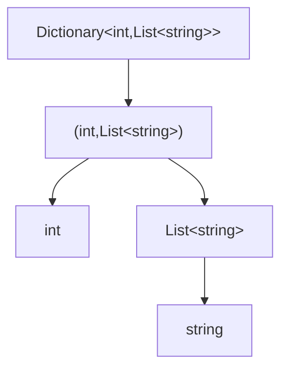
</td>
<td>

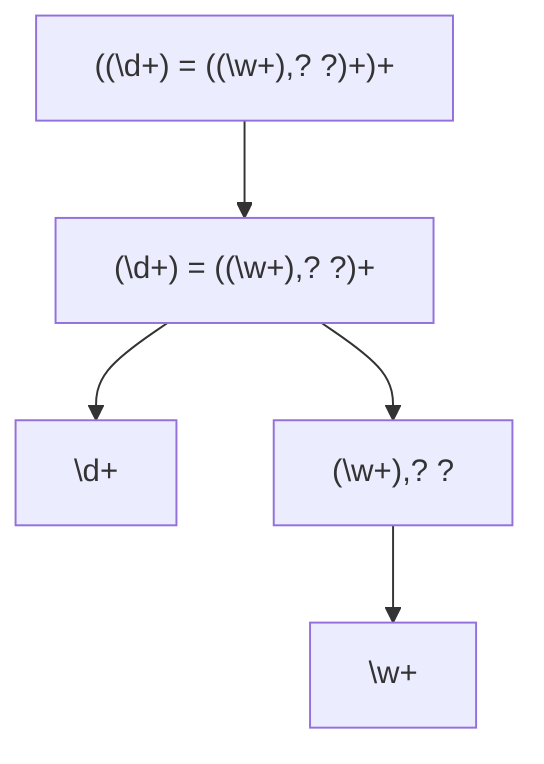
</td>
</tr>
</table>

# Record with two values

<table>
<tr>
<td>

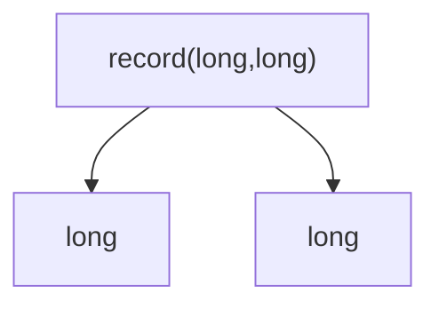
</td>
<td>

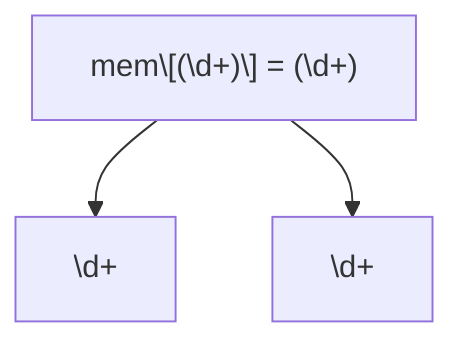
</td>
</tr>
</table>

# List of List of List of char

<table>
<tr>
<td>

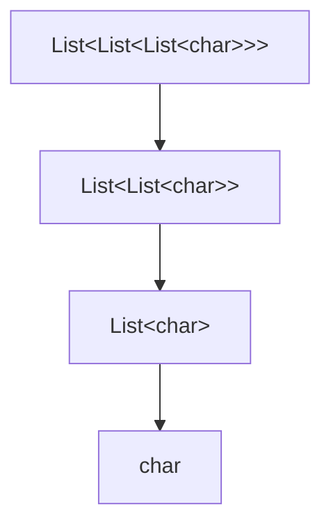
</td>
<td>

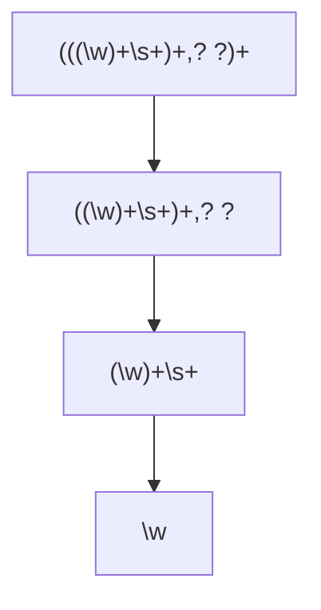
</td>
</tr>
</table>
